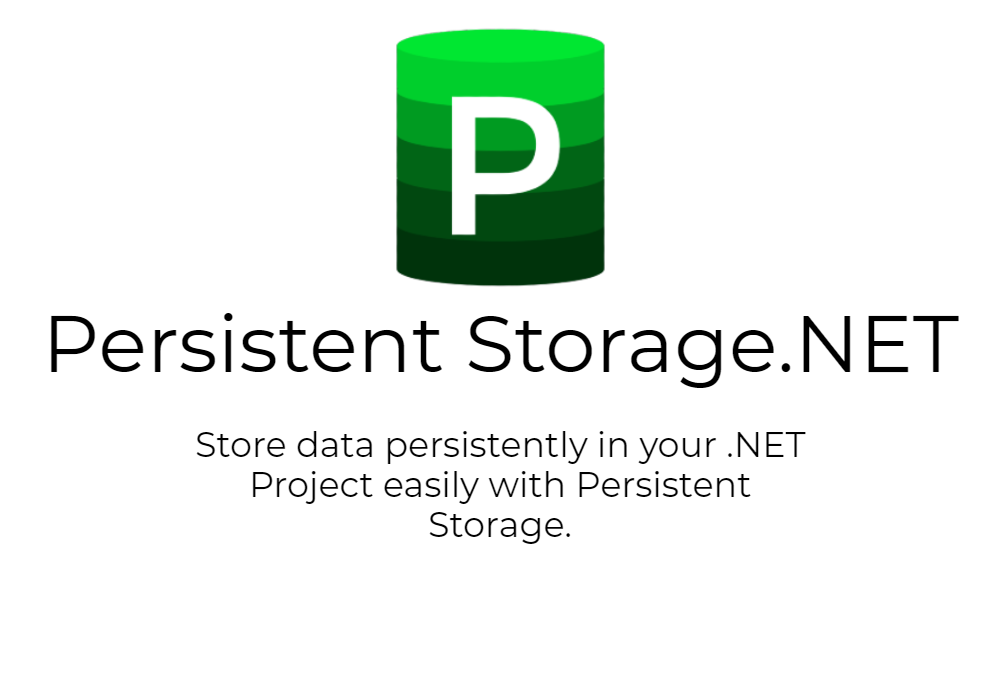

  <a href="https://www.nuget.org/packages/Garamia.PersistentStorage"></img></a>
  <a href="https://github.com/jtsshieh/PersistentStorage/actions?query=workflow%3ADocFX"></img></a>
  <a href="https://github.com/jtsshieh/PersistentStorage/blob/master/LICENSE"></img></a>

[Documentation](https://jtsshieh.github.io/PersistentStorage/) 
