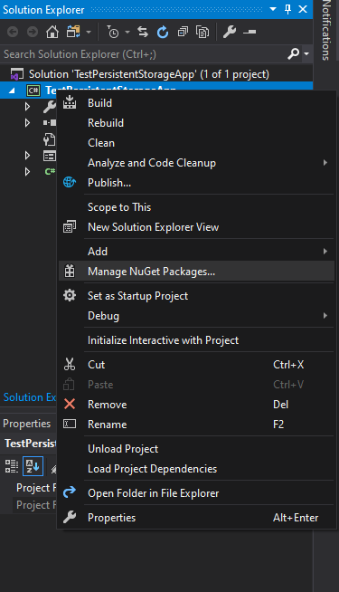
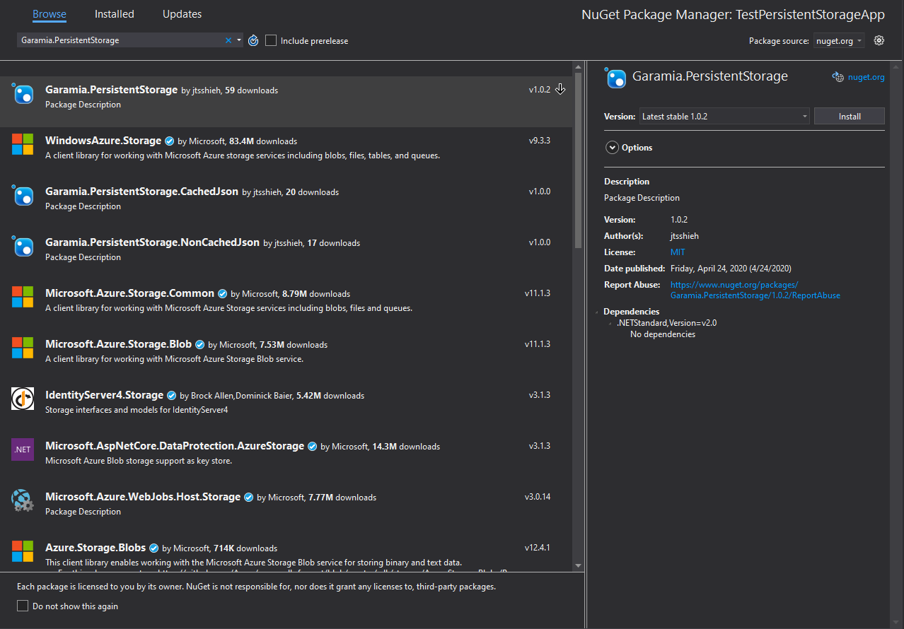

# Installation

The preferred way to install Garamia.PersistentStorage is adding it through the NuGet package manager. It is also possible to compile the library yourself, but this is not recommended.

## Supported Frameworks

Garamia.PersistentStorage targets .NET Standard 2.0.
The table below lists the minimum version of .NET implementations that support .NET Standard 2.0. It is recommended that you use .NET Core or .NET Framework.

| .NET Standard              | 2.0        |
| :------------------------ | :--------: |
| .NET Core                  | 2.0        |
| .NET Framework             | 4.6.1      |
| Mono                       | 5.4        |
| Xamarin.iOS                | 10.14      |
| Xamarin.Mac                | 3.8        |
| Xamarin.Android            | 8.0        |
| Universal Windows Platform | 10.0.16299 |
| Unity                      | 2018.1     |

## Installing with NuGet in Visual Studio

1. Launch Visual Studio and create a solution targeting one of the frameworks that Garamia.PersistentStorage supports.
2. Right click the solution or the project and click on "Manage NuGet Packages". 
3. Go to the "Browse" tab and search for "Garamia.PersistentStorage". 
4. Select the one by "jtsshieh" and follow the prompts to install the latest version.

## Compiling from Source

### Compiling through Visual Studio

When compiling through Visual Studio, you need Visual Studio and .NET desktop development.

1. Clone the repository
2. Open "PersistentStorage.sln" in Visual Studio.
3. Build the solution with the default settings.
4. Navigate to "src/PersistentStorage/bin/Debug/netstandard2.0/"
5. Add "PersistentStorage.dll" as a reference in your project.
